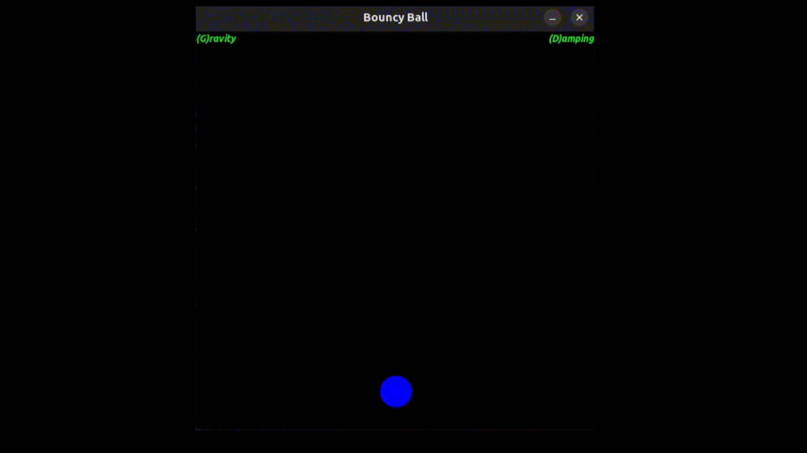

# Bouncy Ball 📐🎱

This simple SFML application simulates real-world physics utilizing a little bouncy ball. 
Users can interact with the ball, by clicking it and disabling/enabling the gravity
and damping applied to the ball observe it's realistic behavior as it bounces around the screen. 

## Requirements 
- SFML Library - Ensure that you have the SFML library installed.
- C++ Compiler
- CMake (or other linking tool)

# Installation
- Make sure to have SFML already installed
- In the project directory run `chmod +x compile.sh` to build and run.

## Features 
* **Realistic Physics**: The application incorporates real-world physics principles, mainly gravity and damping. 
* **Interactive**: Users can interact with the ball by clicking and dragging it around the screen.
* **Visual Feedback**: Demonstrates the effects of gravity, momentum, collisions, acceleration and velocity.

## Design

Utilized a simple **_OOP_** approach to separate shared data, window functions, collision detection and ball actions. 
A cooler example of a **_state machine_** design can be viewed in my [Flappy Bird](https://github.com/sudo-swe/SFML-FlappyBird) recreation. 

## Demo

## Controls

* `P` to toggle Pause
* `Q` to Quit
* 'D' to toggle Damping
* 'G' to toggle Gravity
* `Mouse` to drag the ball and give it acceleration

---

Feel free to use this however you like. 
- [@sudo-swe](https://github.com/sudo-swe)
